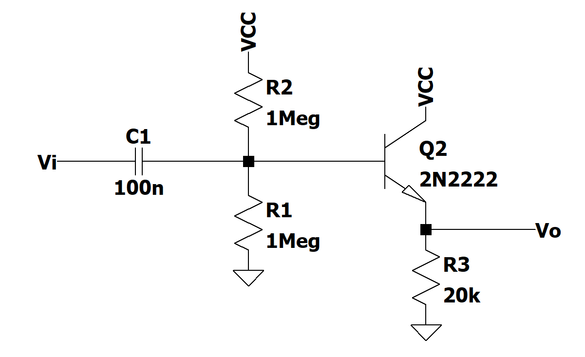
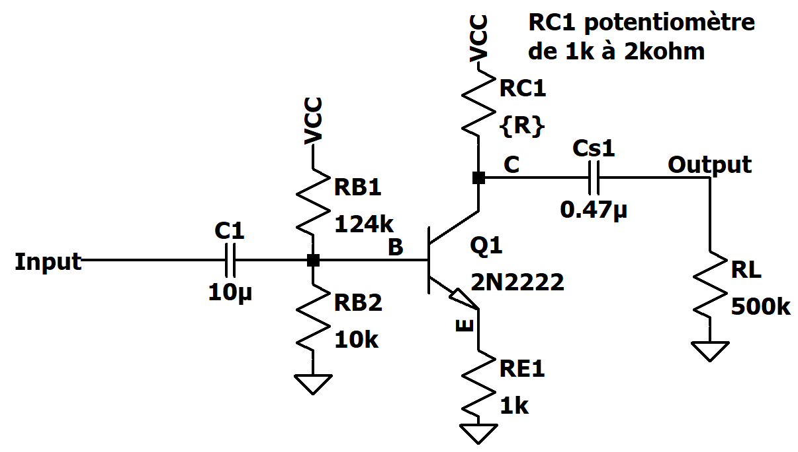
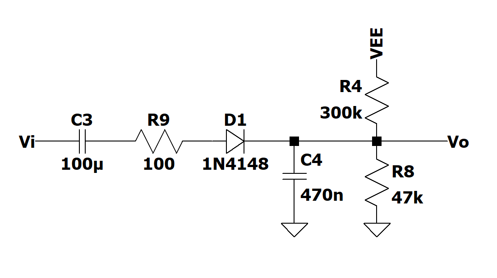
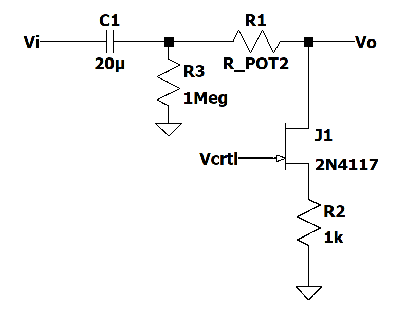
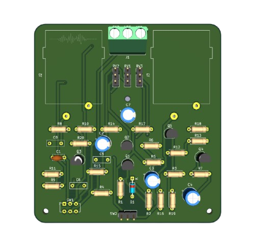

# Guitar Pedal — Analog Compressor

> Complete analog guitar compressor pedal project, including schematic and PCB design (KiCad) and simulations (LTSpice).

---

## Quick overview

This project designs and documents an **analog guitar compressor**: input/output adaptation, amplification, envelope detection, and gain control. It includes the **schematic**, **PCB**, as well as **simulations** and **test results**.

### Key features

- **Analog compression**: dynamic reduction of the audio signal
- **Complete signal chain**: input adaptation, amplification, peak detection, gain control, output adaptation
- **Hardware design**: schematic + PCB routing in KiCad
- **Simulation**: LTSpice models and sub‑block tests
- **Visual documentation**: block diagrams and simulation captures

---

## Circuit overview

<div align="center">


**Global diagram** — *Functional architecture of the pedal*

</div>

<div align="center">


**Global circuit** — *Schematic overview*

</div>

---

## Sub‑block details

### Input adaptation

<div align="center">



**Input adaptation** — *Guitar signal conditioning*

</div>

### Amplification

<div align="center">



**Amplification** — *Signal amplification stages*

</div>

### Peak detection / envelope

<div align="center">



**Peak detection** — *Envelope generation for control*

</div>

### Gain control / attenuation

<div align="center">



**Gain control** — *Envelope‑controlled attenuation*

</div>

### Output adaptation

<div align="center">


**Output adaptation** — *Compatibility with amp or audio interface*

</div>

---

## LTSpice simulations

<div align="center">


**Envelope simulation** — *Detection response*

</div>

<div align="center">


**Signal simulation** — *Compression effect on the signal*

</div>

---

## PCB — Photos

<div align="center">


**PCB back side**

</div>

<div align="center">



**PCB component side**

</div>

---

## Project structure

```
Analog-Compressor-Pedal/
├── README.md
├── doc/                       # Visual documentation and images
├── LTSpice/                   # Schematics and simulation tests
│   ├── Circuit_complet_avec_Adaptation.asc
│   ├── Audio Tests/
│   ├── Circuit Test Results/
│   └── PWL Sound Files/
└── pedaleGuitareComp/         # KiCad project (schematic + PCB)
		├── pedaleGuitareComp.kicad_sch
		├── pedaleGuitareComp.kicad_pcb
		└── footprints_perso/
```

---

## Open the project

### KiCad
- Open the project in [pedaleGuitareComp/](pedaleGuitareComp/)
- Main files:
	- Schematic: [pedaleGuitareComp/pedaleGuitareComp.kicad_sch](pedaleGuitareComp/pedaleGuitareComp.kicad_sch)
	- PCB: [pedaleGuitareComp/pedaleGuitareComp.kicad_pcb](pedaleGuitareComp/pedaleGuitareComp.kicad_pcb)

### LTSpice
- Full schematic: [LTSpice/Circuit_complet_avec_Adaptation.asc](LTSpice/Circuit_complet_avec_Adaptation.asc)
- Tests and results: [LTSpice/](LTSpice/)


---

## Authors

- **Bosco de Rauglaudre**
- **Titouan Bocquet**
- **Gavin Mac Aonghusa**


